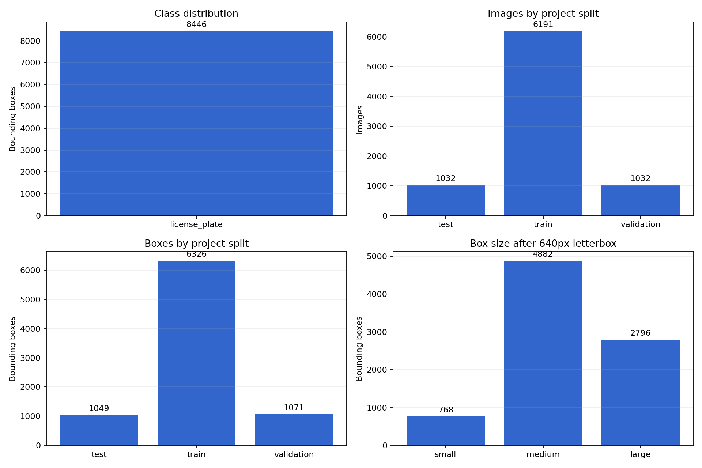
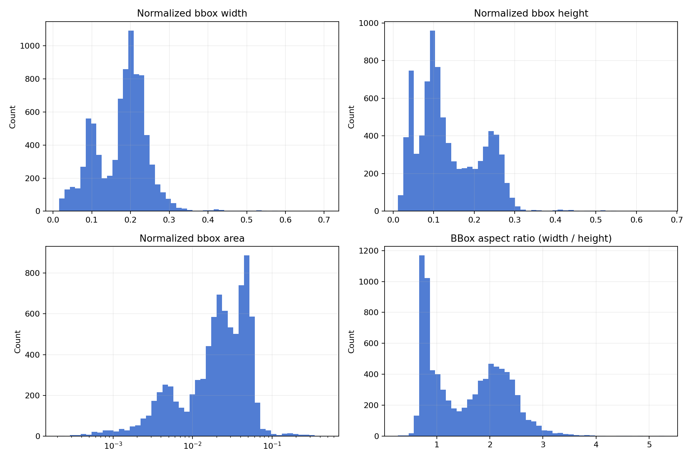
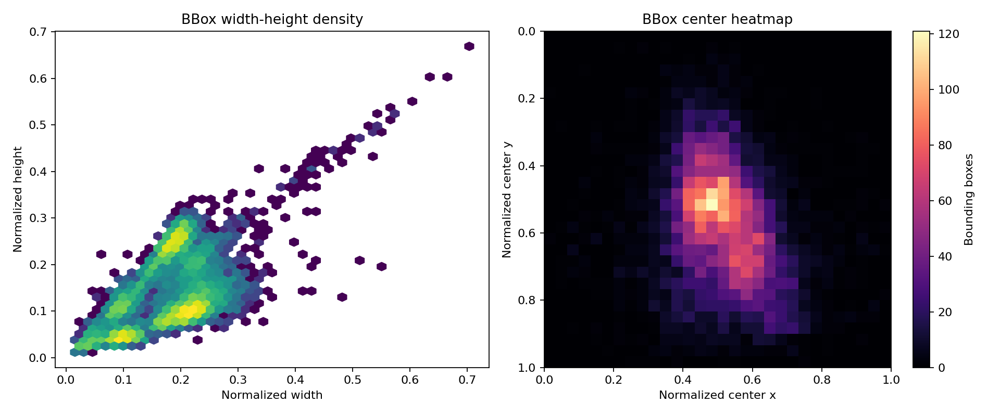
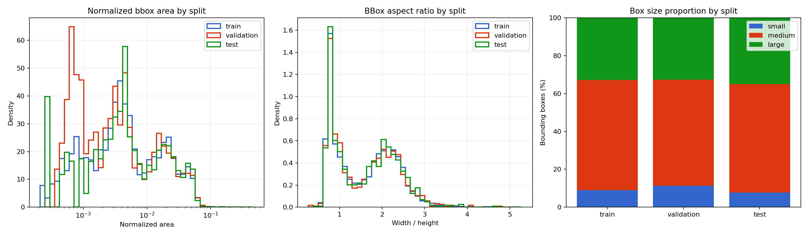
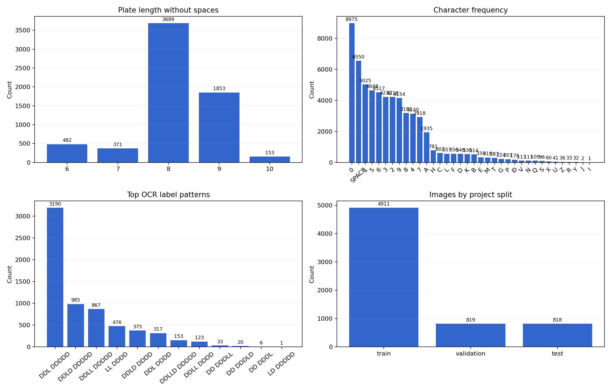
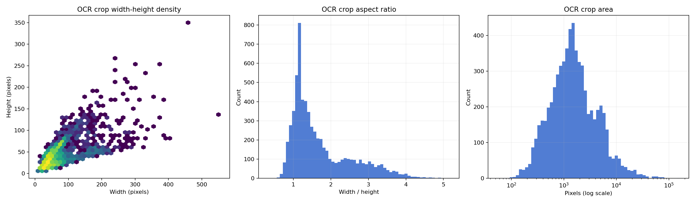
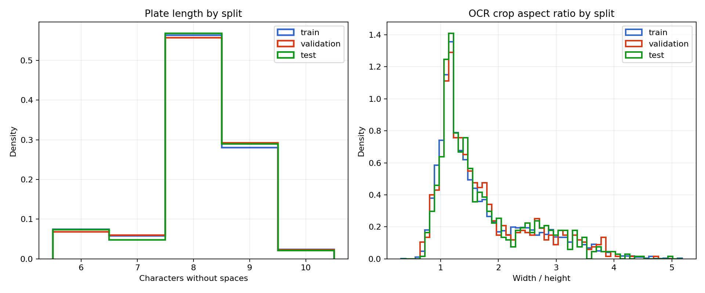

# Dataset report

## Status

Detection and OCR are treated as separate source datasets. Both selected sources have been
downloaded into versioned immutable directories with typed completion receipts and deterministic
content fingerprints. Both sources have passed the initial structural, pairing, label parsing, and
full-image decode checks. Automated statistics, duplicate detection, annotation review,
correction/exclusion handling, exact deduplication, and project-owned splits are complete.

This split is intentional. For this project, "end-to-end" refers to the pipeline output, not to a
requirement that one public dataset must contain every annotation type. Separate component datasets
are acceptable as long as the final benchmark set is frozen and human-verified.

## Detection source

- Kaggle handle: `miahuynh04/vietnamese-license-plate-detection`
- Dataset version: `1`
- Data-card license claim: MIT
- Versioned raw path: `data/raw/kaggle/detection/v1`
- Receipt file count: 16,519
- Receipt content size: 366,308,679 bytes
- Content SHA-256: `51de1ea6a00699bffd8c9c8cd58fbeefa3eccdcb9404b8a276152ca31a1a0956`

The license value above is not yet treated as verified provenance. A copy of the license or other
primary evidence distributed with the dataset has not been found in the downloaded files.

## Detection structural inventory

| Split | Images | Label files | Bounding boxes | Multi-plate images |
|---|---:|---:|---:|---:|
| Train | 6,607 | 6,607 | 6,785 | 117 |
| Validation | 814 | 814 | 818 | 3 |
| Test | 838 | 838 | 849 | 9 |
| **Total** | **8,259** | **8,259** | **8,452** | **129** |

All images currently use the `.jpg` extension. Labels use YOLO detection format with one class:

```text
class_id center_x center_y width height
```

The initial structural scan found:

- zero missing image-label pairs;
- zero orphan label files;
- zero empty label files;
- no rows with a field count other than five;
- no normalized coordinate values outside `[0, 1]`;
- all 8,259 images decode successfully;
- all 8,452 bounding boxes pass the typed YOLO schema;
- no OCR text labels.

Seventeen boxes touch an image boundary and exceed the mathematical edge by approximately
`5e-7` after their source values are rounded to six decimal places. The schema accepts boundary
error up to `1e-6`, while retaining the original values and rejecting material overflow. Raw
annotations are not clamped or edited.

Measured detection statistics:

| Property | Minimum | Median | Maximum |
|---|---:|---:|---:|
| Image width (pixels) | 216 | 472 | 4,653 |
| Image height (pixels) | 159 | 303 | 2,910 |
| Normalized bbox width | 0.015625 | 0.190678 | 0.703333 |
| Normalized bbox height | 0.011662 | 0.115512 | 0.668750 |
| Normalized bbox area | 0.000210 | 0.023270 | 0.470354 |

## Detection EDA

The EDA is generated from the project-owned split, not the source-provided split:

```powershell
python scripts/analyze_detection_data.py --config configs/dataset.yaml
```

The processed dataset contains 8,446 annotations belonging to the single `license_plate` class.
Four byte-identical records were removed before EDA and training. Class imbalance is therefore not
applicable inside this detection task, but the count verifies that no unexpected class id entered
the manifest.

Box size is measured after preserving aspect ratio and letterboxing the source image into the
configured 640-pixel training canvas. The small/medium/large thresholds use areas below `32²`,
from `32²` to `96²`, and at least `96²` pixels respectively. These COCO-inspired thresholds are
diagnostic categories, not Vietnamese plate semantics.

| Resized box size | Count | Percentage |
|---|---:|---:|
| Small | 768 | 9.1% |
| Medium | 4,882 | 57.8% |
| Large | 2,796 | 33.1% |



The aspect-ratio distribution is bimodal: one cluster is near square and another is around twice
as wide as high. This is consistent with the dataset containing both two-line and one-line plate
layouts. The median aspect ratio is `1.569`, while the observed range is `0.270` to `5.284`.
Extreme ratios should be included in failure analysis rather than removed solely for being rare.



Bbox centers are concentrated near the lower-middle region. Their median normalized center is
`(0.514, 0.573)`. This creates a possible position prior: performance on plates close to image
boundaries must be checked with an external test set.



The three project splits have similar medians and size proportions:

| Split | Boxes | Median area | Median aspect ratio | Small | Medium | Large |
|---|---:|---:|---:|---:|---:|---:|
| Train | 6,326 | 0.023193 | 1.566 | 8.9% | 58.2% | 32.8% |
| Validation | 1,071 | 0.022382 | 1.571 | 11.4% | 55.8% | 32.8% |
| Test | 1,049 | 0.024473 | 1.605 | 7.7% | 57.3% | 35.0% |

Validation contains a slightly higher small-box share, but no severe split-level shift is visible
in area or aspect ratio. Detection evaluation must still report recall by box-size group so the
overall mAP does not hide weak small-plate performance.



## OCR source decision

Selected OCR baseline source:

- Kaggle handle: `wirqhuy/vietnamese-license-plate-ocr`
- Dataset version: `1`
- Data-card license claim: MIT
- Versioned raw path: `data/raw/kaggle/ocr/v1`
- Receipt file count: 6,646
- Receipt content size: 10,968,384 bytes
- Content SHA-256: `a0042b3f9af82f38fbb1894f869e303cbbd6a25b8690ed834f1aeafeb676ede9`
- Structure observed during inspection:
  - `imgs/train`: 5,314 images
  - `imgs/val`: 1,329 images
  - `labels/train.txt` and `labels/val.txt` with `image_path<TAB>plate_text`

Sample labels observed:

```text
imgs/train/type5_258.jpg    BT 5581
imgs/train/type7_527.jpg    51G 46455
imgs/val/type4_628.jpg      73B 0040
```

The initial OCR structural scan found:

- 5,314 train image-label pairs;
- 1,329 validation image-label pairs;
- zero missing images;
- zero unreferenced images;
- zero empty paths or labels;
- exactly one tab separator in every label row;
- all 6,643 images decode successfully;
- UTF-8 labels include spaces and the Vietnamese character `Đ`.

Measured OCR statistics:

| Property | Minimum | Median | Maximum |
|---|---:|---:|---:|
| Crop width (pixels) | 9 | 46 | 556 |
| Crop height (pixels) | 6 | 31 | 350 |
| Raw text length | 5 | 9 | 11 |

The observed character set is:

```text
 0123456789ABCDEFGHIJKLMNOPQRSTUVXYZĐ
```

## OCR EDA

OCR EDA runs on the corrected, excluded, and exact-deduplicated processed manifest:

```powershell
python scripts/analyze_ocr_data.py --config configs/dataset.yaml
```

The processed OCR dataset contains 6,548 crops. Most labels contain eight or nine characters after
spaces are removed:

| Characters | Samples |
|---:|---:|
| 6 | 481 |
| 7 | 372 |
| 8 | 3,689 |
| 9 | 1,853 |
| 10 | 153 |

Character-frequency analysis exposed one incorrect source label containing `O`: `BOE90955`, which
was corrected to `30E 90955`. Three reviewed labels containing rare `I` or `J` symbols are valid
under the source dataset's annotation convention and remain unchanged. The Vietnamese character
`Đ` occurs 199 times and remains in the OCR alphabet.



Crop dimensions range from 9 to 556 pixels wide and 6 to 350 pixels high. Median dimensions are
46 by 31 pixels, and the median aspect ratio is 1.417. Very small crops are an expected OCR failure
mode and must be evaluated separately.



All project splits have median normalized text length 8. Median crop aspect ratios are 1.409,
1.444, and 1.425 for train, validation, and test. No severe split-level geometry or text-length
shift is visible.



## Duplicate audit

The audit uses SHA-256 for exact duplicates and 64-bit difference hashes for near-duplicate
candidates. Near candidates use a Hamming-distance threshold of 6.

| Task | Exact groups | Exact groups crossing source splits | Near candidate pairs | Near pairs crossing source splits |
|---|---:|---:|---:|---:|
| Detection | 4 | 1 | 9,888 | 3,332 |
| OCR | 93 | 31 | 629 | 208 |

Exact duplicates are byte-identical evidence. The source-provided splits therefore contain known
leakage: one exact detection group and 31 exact OCR groups cross source split boundaries. The
project split must keep each duplicate group together instead of trusting the source split.

All four exact detection groups have slightly different bounding boxes for byte-identical images.
Two exact OCR groups have conflicting text:

```text
imgs/train/car_338.jpg -> 30A 34588
imgs/train/car_352.jpg -> 30A 31588

imgs/train/car_553.jpg -> 30G 31553
imgs/train/car_522.jpg -> 80G 31553
```

Visual review and OCR outlier analysis produced three text corrections. Two additional crops
contain only a visible suffix because their plate prefix is overexposed; these samples are excluded
rather than assigned guessed labels. All eight decisions are recorded in
`configs/ocr-corrections.jsonl` and applied only while building the OCR manifest. Each decision
includes the expected original text, so a changed source fails loudly instead of receiving a stale
correction. Raw labels are not modified in place.

Near-duplicate counts are candidate counts, not confirmed duplicate counts. The high detection
count shows that the current dHash threshold also retrieves visually similar layouts. Candidates
must be visualized and sampled before they are used to create final duplicate groups.

## Manual-review queue

A deterministic review queue has been generated from the manifest and audit fingerprints:

```text
data/interim/manual_review/<manifest-hashes>-<seed>/
```

It contains:

- 100 detection visualizations with bounding boxes overlaid;
- 100 OCR visualizations with the raw label below each crop;
- `review_queue.jsonl` with the sample id, source path, priority reasons, and `pending` status.

The queue prioritizes annotation conflicts, exact duplicates crossing source splits, and the closest
near-duplicate candidates before filling the remaining capacity with a seeded random sample.
Review decisions are summarized in `reports/review_summary.md`:

- all 100 sampled detection boxes visually contain the intended license plate;
- 98 initially sampled OCR labels are visually plausible;
- six OCR labels require correction after contact-sheet and outlier review;
- two incomplete OCR labels require exclusion;
- four byte-identical detection groups use one deterministic canonical record.

## Project split

`scripts/split_data.py` reduces each exact SHA-256 group to the record with the lexicographically
smallest `sample_id`, then assigns the remaining records to project-owned splits. Source split
leakage and within-split exact duplication are both removed. Assignment is reproducible from seed
configured in `configs/dataset.yaml`.

| Task | Train | Validation | Test | Exact SHA groups crossing project splits |
|---|---:|---:|---:|---:|
| Detection | 6,191 | 1,032 | 1,032 | 0 |
| OCR | 4,911 | 819 | 818 | 0 |

The processed manifests are:

```text
data/processed/detection_manifest.jsonl
data/processed/ocr_manifest.jsonl
```

Near-duplicate candidates are deliberately not used as automatic groups. At Hamming distance 6,
connected components become too broad and merge visually similar but distinct plates. Vehicle,
video, and capture-session metadata are unavailable, so the current split guarantees isolation of
byte-identical images only.

Secondary OCR source kept for possible augmentation only:

- Kaggle handle: `topkek69/vietnamese-license-plate-ocr`
- Structure observed during inspection:
  - `cropped`: 6,643 images
  - `generated`: 5,547 images
  - `labels/crop_labels.csv`
  - `labels/gen_labels.csv`

This source mixes real cropped plates with generated images. It may help OCR robustness later, but
it should not be treated as the primary benchmark dataset until we quantify the effect of synthetic
data.

Rejected as OCR source:

- `johnkhanhnguyen/vietnamese-license-plate`

This dataset contains YOLO detection labels only and does not provide OCR strings.

## Current limitations

- Completion receipts prove source identity and byte-level contents, not annotation correctness.
- No video, vehicle, capture-session, or duplicate group identifiers are present.
- The selected OCR dataset has text labels, but it is not paired with full-scene plate bounding
  boxes from the detection dataset.
- One hundred bounding-box samples passed visual review.
- Near-duplicate candidates have only been sampled and are not safe automatic groups.
- Processed manifests use deterministic canonical records for exact duplicates.
- A final end-to-end test set with human-verified plate text still needs to be built.
- A legacy unversioned detection download remains under `data/raw/kaggle`; it is ignored by the
  configured pipeline and has not been deleted automatically.
